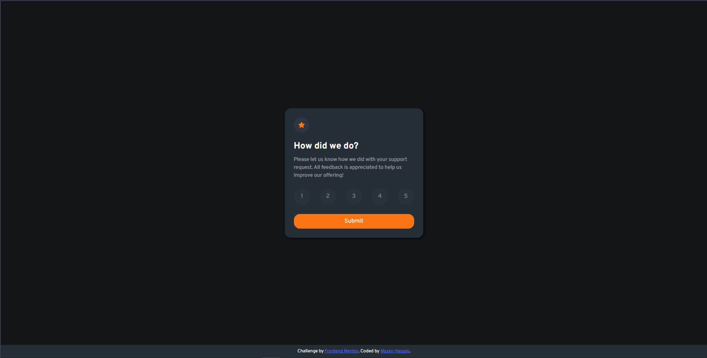
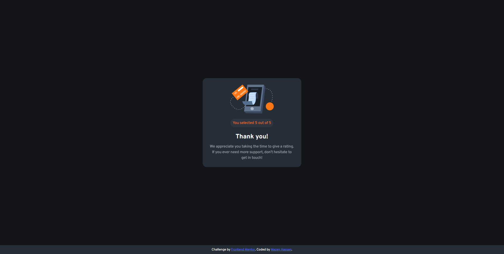

# Frontend Mentor - Interactive rating component solution

This is a solution to the [Interactive rating component challenge on Frontend Mentor](https://www.frontendmentor.io/challenges/interactive-rating-component-koxpeBUmI). Frontend Mentor challenges help you improve your coding skills by building realistic projects. 

## Table of contents

- [Frontend Mentor - Interactive rating component solution](#frontend-mentor---interactive-rating-component-solution)
  - [Table of contents](#table-of-contents)
  - [Overview](#overview)
    - [The challenge](#the-challenge)
    - [Screenshot](#screenshot)
    - [Links](#links)
    - [Built with](#built-with)
    - [What I learned](#what-i-learned)
    - [Continued development](#continued-development)
    - [Useful resources](#useful-resources)
  - [Acknowledgments](#acknowledgments)

## Overview

### The challenge

Users should be able to:

- View the optimal layout for the app depending on their device's screen size
- See hover states for all interactive elements on the page
- Select and submit a number rating
- See the "Thank you" card state after submitting a rating

### Screenshot





### Links

- Solution URL: [Add solution URL here](https://your-solution-url.com)
- Live Site URL: [Add live site URL here](https://interactive-rating-component-silk-three.vercel.app/)

### Built with

- Semantic HTML5 markup
- CSS custom properties
- Flexbox
- CSS Grid
- Mobile-first workflow
- [Styled Components](https://sass-lang.com/) - For styles

### What I learned
In this project:

- I worked with new form challenge using radio inputs and learned the proper, accessible and clean approach in setting up html semantic and use it in js.
- I learned how to style custom input and replace the native style that comes with browser.
- Learned the next sibling combinator and used it to share input interactions to the label element.

```html
  <form id="form">
          <fieldset class="rate-fieldset">
            <legend class="field-caption-visibility">Rating feedback </legend>

            <div class="input-wrapper">
              <input type="radio" name="rating" value="1" id="1" class="visually-hidden">
              <label for="1" class="radio-rate">1</label>
            </div>
  </form>
```

The use of position relative + absolute is very important to hide the element while being accessible by screenreaders.
```css
.input-wrapper {
    position: relative;
    aspect-ratio: 1;

    //Input visibility
    .visually-hidden {
        clip: rect(0 0 0 0);
        clip-path: inset(50%);
        height: 1px;
        overflow: hidden;
        position: absolute;
        white-space: nowrap;
        width: 1px;
    }
}
```

I learned the new FormData built-in function that simplify getting form submitted by user and use it to perform the required action.
```js
 const formdata = new FormData(form);
 //Getting the input name attribute shared between all inputs
 const rating = formdata.get('rating');
```

### Continued development
In the next JS challenges, I want to practice my skills with validating forms and read more documentation on related concepts. I also want to improve on HTML semantics and CSS pseudo-classes to achieve custom-styled forms with proper and clean accessibility.

### Useful resources

- [Example resource 1](https://developer.mozilla.org/en-US/docs/Web/HTML/Element/input/radio) - This MDN documentation was great in helping me understand the general approach to setup a radio input form.
- [Example resource 2](https://moderncss.dev/pure-css-custom-styled-radio-buttons/) - This article was great to get me understanding how to customize a radio input.


## Acknowledgments
Thanks so much for the great FEM Discord community. I always get a detailed response with best tips, good practice, and pointing out mistakes and how to improve.